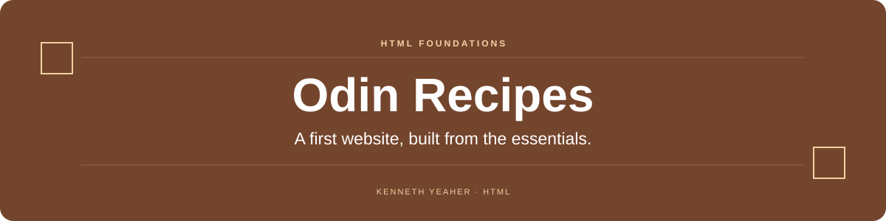

  

  

<a href="index.html">Recipe index</a> &nbsp; · &nbsp; <a href="recipes/">Recipe pages</a>

## Overview

An early HTML project linking a recipe index to five individual recipe pages. It practices document structure, relative links, images, and list-based content before adding a styling or scripting layer.

## At a glance

| Area | What to look for |
| --- | --- |
| **Navigation** | One index connects the five recipe pages with relative links. |
| **Content** | Individual pages organize recipe information and images. |
| **Scope** | Plain HTML keeps the project focused on the fundamentals of a document-based website. |

## Start here

Open `index.html` in a browser. No dependencies, JavaScript, or build step are required.

## Scope

This is a foundational HTML exercise. It does not currently include a custom CSS design or interactive recipe features.

---

<strong>Original project note</strong>

# odin-recipes
First HTML Project

In this project, I will be showcasing my HTML skills by creating a basic recipe website.

For now, the site won't be too pretty, as it will mainly be HTML. However, I will be coming back to this project to incorporate CSS and enhance the user experience.

Cheers!
Ken

