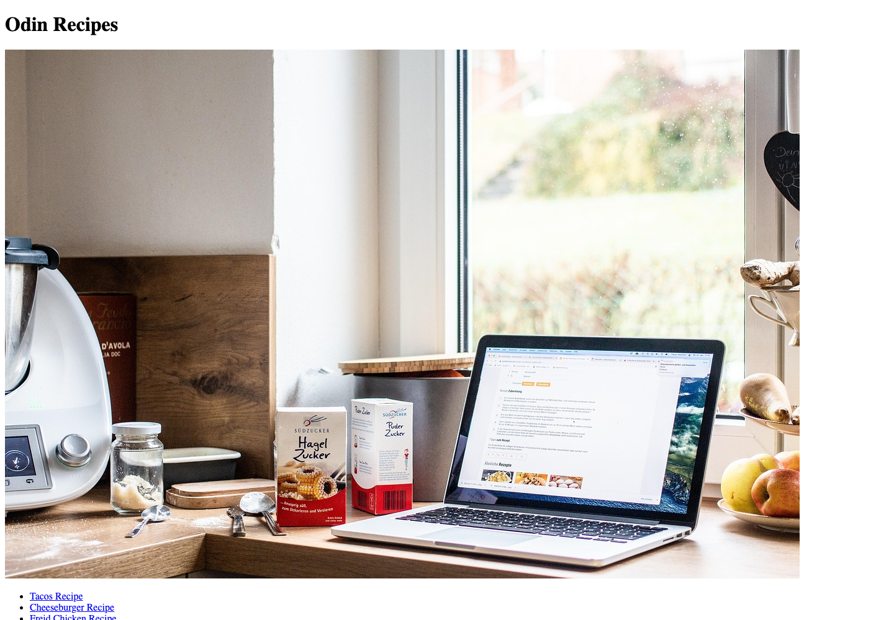

# Odin Recipes

A first HTML website built while working through The Odin Project. A recipe index links to cheeseburger, New York strip steak, and pepperoni pizza pages, practicing document structure, relative navigation, images, and lists.

## What I built

I organized the recipe pages and local image assets into a small browsable site. The focus is foundational HTML; the repository does not yet include a stylesheet or JavaScript.

## View locally

Open `index.html` in a browser, then follow a recipe link. Keep the `recipes/` and `images/` folders beside the index so relative paths resolve. No installation or build step is required.

## Project map

| Location | Purpose |
| --- | --- |
| `index.html` | Starting page and links to three recipes. |
| `recipes/` | Individual recipe documents. |
| `images/` | Images loaded through relative paths. |

A useful review starts by following all three links, returning to the index, and checking that images load when the whole folder is moved. The exercise makes the relationship between document structure and file organization tangible before adding styling.

## Context and limits

This is a learning exercise from [The Odin Project](https://www.theodinproject.com/). Recipe text and photographs are demonstration content; this repository does not establish original authorship of those materials. The large index image uses the browser's default sizing, so the layout is not yet responsive.

---

## Author

**Kenneth Yeaher**  
MS in Human Computer Interaction  
University of Maryland, College Park  

`HTML` · `Relative Navigation`
